# 🚀 Binance Crypto Dashboard MVP

[](https://binance-crypto-dashboard-flax.vercel.app)
[](https://nextjs.org/)
[](https://www.typescriptlang.org/)
[](https://tailwindcss.com/)

O aplicație completă de dashboard crypto pentru Binance, construită cu Next.js 14 (App Router) și optimizată pentru deployment pe Vercel. Oferă vizualizare în timp real a portofoliului crypto cu interfață profesională și funcționalități avansate.

🌐 **Live Demo**: [https://binance-crypto-dashboard-flax.vercel.app](https://binance-crypto-dashboard-flax.vercel.app)

## ✨ Caracteristici Principale

- 📊 **Real-time Portfolio Management** - Vizualizare automată la 30s cu SWR
- 🔒 **Securitate Avansată** - Chei API doar server-side, validare Zod, rate limiting
- 📱 **UI Responsivă** - Design modern cu Tailwind CSS, dark/light theme
- 📈 **Vizualizări Interactive** - Grafice Chart.js, tabele sortabile cu filtrare
- 📄 **Export CSV** - Funcționalitate completă de export pentru analiză
- ⚡ **Performance Optimizat** - Cache inteligent, retry logic, error handling
- 🚀 **Deploy Ready** - Configurație completă pentru Vercel cu zero-config

## 🏗️ Arhitectură și Stack Tehnologic



```mermaid
graph TB
    A[Browser/Client] -->|HTTPS| B[Vercel Edge Network]
    B --> C[Next.js 14 App Router]
    C --> D[API Route /api/binance-balance]
    D -->|Secure Server-Side| E[Binance API]
    
    F[Environment Variables] --> D
    G[SWR Cache] --> C
    H[Chart.js] --> C
    I[Tailwind CSS] --> C
    
    style E fill:#f9d71c
    style D fill:#0070f3
    style C fill:#000
    style B fill:#000
```

### Stack Tehnologic

- **Frontend**: Next.js 14 cu App Router, React 18, TypeScript
- **Styling**: Tailwind CSS, next-themes pentru dark/light mode
- **API Integration**: binance-api-node pentru comunicarea securizată cu Binance
- **State Management**: SWR pentru caching și real-time updates
- **Data Visualization**: Chart.js cu react-chartjs-2 pentru grafice interactive
- **Deployment**: Vercel cu serverless functions și edge network
- **Development**: ESLint, TypeScript strict mode, hot reload

## 🚀 Setup Local

### Prerequisite

- Node.js 18+ și npm/yarn
- Cont Binance cu API keys (testnet sau mainnet)
- Git pentru clonarea repository-ului

### 1. Clonează Repository-ul

```bash
git clone https://github.com/Gzeu/binance-crypto-dashboard.git
cd binance-crypto-dashboard
```

### 2. Instalează Dependențele

```bash
npm ci
# sau
yarn install
```

### 3. Configurează Environment Variables

```bash
cp .env.example .env.local
```

Editează `.env.local` cu cheile tale Binance:

```env
# Binance API Configuration
# Obține de la: https://www.binance.com/en/my/settings/api-management
BINANCE_API_KEY=your_actual_binance_api_key_here
BINANCE_API_SECRET=your_actual_binance_secret_key_here

# Application Configuration  
NEXT_PUBLIC_APP_URL=http://localhost:3000
```

### 4. Rulează în Development

```bash
npm run dev
# sau
yarn dev
```

Aplicația va fi disponibilă la `http://localhost:3000`

## 🔒 Configurarea Cheilor Binance API

### Pasul 1: Creează API Key

1. Mergi la [Binance API Management](https://www.binance.com/en/my/settings/api-management)
2. Creează un nou API key cu numele "Crypto Dashboard"
3. **Important**: Activează doar "Enable Reading" - NU activa trading!
4. Copiază API Key și Secret Key

### Pasul 2: Restricții de Securitate (Recomandate)

- ✅ **Enable Reading**: DA
- ❌ **Enable Spot & Margin Trading**: NU
- ❌ **Enable Futures**: NU
- ✅ **Restrict access to trusted IPs**: DA (opțional, pentru siguranță maximă)

### Pasul 3: Testare

Testează conexiunea:

```bash
curl http://localhost:3000/api/binance-balance
```

Răspuns de succes:
```json
{
  "balances": [...],
  "totalPortfolioUSDT": "1234.56",
  "accountType": "SPOT",
  "canTrade": true
}
```

## 🚀 Deploy pe Vercel

### Metoda 1: Vercel CLI (Recomandată)

```bash
# Instalează Vercel CLI
npm i -g vercel

# Login în Vercel
vercel login

# Deploy
vercel --prod
```

### Metoda 2: GitHub Integration

1. Conectează repository-ul la Vercel
2. Setează environment variables în Vercel Dashboard:
   - `BINANCE_API_KEY`
   - `BINANCE_API_SECRET`  
   - `NEXT_PUBLIC_APP_URL` (URL-ul aplicației deployed)
3. Deploy automat la fiecare push pe `main`

### Variabile de Mediu în Vercel

```bash
# Via Vercel CLI
vercel env add BINANCE_API_KEY
vercel env add BINANCE_API_SECRET
vercel env add NEXT_PUBLIC_APP_URL
```

Sau manual în [Vercel Dashboard](https://vercel.com/dashboard) → Project Settings → Environment Variables

## 📊 API Documentation

### GET /api/binance-balance

Returnează balanțele portofoliului crypto cu conversie în USDT.

#### Response Schema

```typescript
interface PortfolioData {
  balances: AssetBalance[];
  totalPortfolioUSDT: string;
  accountType: string;
  canTrade: boolean;
  canWithdraw: boolean;
  canDeposit: boolean;
  updateTime: string;
  serverTime: string;
  cached?: boolean;
}

interface AssetBalance {
  asset: string;           // "BTC", "ETH", etc.
  free: string;            // Balanță disponibilă
  locked: string;          // Balanță blocată în ordere
  total: string;           // Total = free + locked
  priceUSDT: string;       // Preț actual în USDT
  valueUSDT: string;       // Valoare totală în USDT
}
```

#### Features API

- ✅ **Caching**: 15 secunde pentru respectarea rate limits
- ✅ **Retry Logic**: Exponential backoff cu 3 încercări
- ✅ **Error Handling**: Mesaje sanitarizate, fără expunerea cheilor
- ✅ **Rate Limiting**: Respectă limitele Binance (1200 requests/min)
- ✅ **Security**: Validare Zod, chei doar server-side

## 🎨 UI Components

### PortfolioSummary
- Valoare totală portofoliu în USDT
- Numărul de active cu balance > 0  
- Status cont (trading enabled/disabled)
- Indicator cache și timp ultimei actualizări

### AssetTable
- Tabel sortabil după asset, balance, preț, valoare
- Căutare în timp real după nume asset
- Afișare responsivă (mobile-friendly)
- Formatare inteligentă numere (locale-aware)

### AllocationChart
- Grafic pie chart cu Chart.js
- Top 10 active + "Others" pentru restul
- Tooltip-uri interactive cu percentaje
- Design responsive cu center text

### ThemeToggle
- Suport light/dark/system theme
- Persistență cu next-themes
- Tranziții smooth între teme
- Icons intuitive (Sun/Moon/Monitor)

## 🔧 Development

### Scripts Disponibile

```bash
npm run dev         # Development server cu hot reload
npm run build       # Build pentru producție
npm run start       # Start production server
npm run lint        # ESLint checking
npm run type-check  # TypeScript validation
```

### Structura Proiectului

```
binance-crypto-dashboard/
├── app/
│   ├── api/binance-balance/route.ts    # API route securizat
│   ├── globals.css                     # Stiluri globale + CSS variables
│   ├── layout.tsx                      # Root layout cu ThemeProvider
│   └── page.tsx                        # Dashboard principal
├── components/
│   ├── AllocationChart.tsx             # Grafic portofoliu Chart.js
│   ├── AssetTable.tsx                  # Tabel active sortabil
│   ├── PortfolioSummary.tsx           # Cards cu sumar portofoliu
│   ├── ThemeProvider.tsx              # Context pentru teme
│   └── ThemeToggle.tsx                # Switch light/dark
├── lib/
│   ├── types.ts                       # TypeScript interfaces
│   └── csv.ts                         # Utilitar export CSV
├── public/                            # Static assets
├── .env.example                       # Template env variables
├── next.config.js                     # Configurare Next.js
├── tailwind.config.js                 # Configurare Tailwind CSS
└── tsconfig.json                      # TypeScript config
```

## 🛡️ Securitate și Best Practices

### API Security
- ✅ Chei Binance doar server-side (nu în browser)
- ✅ Validare strictă cu schema Zod
- ✅ Rate limiting și cache pentru protecție
- ✅ Error messages sanitarizate
- ✅ HTTPS obligatoriu în producție
- ✅ Headers de securitate configurate

### Environment Variables
- ❌ **NICIODATĂ** commite `.env.local` în Git
- ✅ Folosește `.env.example` pentru documentație
- ✅ Rotește cheile API periodic
- ✅ Monitorizează activitatea API din Binance dashboard

### Rate Limiting
- Binance permite 1200 requests/minut pentru API spot
- Cache de 15 secunde pentru reducerea calls
- Exponential backoff la erori 429
- Monitoring și logging pentru debugging

## 🚨 Troubleshooting

### Erori Comune

#### 1. "Invalid API key format"
- Verifică că API key e corect copiat din Binance
- Nu are spații sau caractere extra
- Key-ul e activ (nu expirat)

#### 2. "Signature verification failed"
- Secret key incorect
- Probleme de sincronizare timp server
- Configurare incorectă `useServerTime: true`

#### 3. "Rate limit exceeded"
- Prea multe requests către Binance
- Cache-ul funcționează corect?
- Verifică alte aplicații care folosesc aceleași chei

#### 4. Build Errors
```bash
# Clearing cache și reinstalare
rm -rf .next node_modules
npm ci
npm run build
```

### Debug Mode

Activează logging detaliat:

```bash
# .env.local
NEXT_PUBLIC_DEBUG=true
```

## 📚 Referințe și Documentație

- 📖 [Binance API Documentation](https://binance-docs.github.io/apidocs/spot/en/)
- 🔗 [binance-api-node Library](https://github.com/Ashlar/binance-api-node)
- ⚡ [Next.js 14 Documentation](https://nextjs.org/docs)
- 🎨 [Tailwind CSS Documentation](https://tailwindcss.com/docs)
- 📊 [Chart.js Documentation](https://www.chartjs.org/docs/)
- 🚀 [Vercel Deployment Guide](https://vercel.com/docs)

## 🤝 Contributing

Contribuțiile sunt binevenite! Pentru schimbări majore:

1. Fork repository-ul
2. Creează branch pentru feature (`git checkout -b feature/amazing-feature`)
3. Commit changes (`git commit -m 'Add some amazing feature'`)
4. Push la branch (`git push origin feature/amazing-feature`)
5. Deschide Pull Request

## 📄 Licență

Acest proiect este licențiat sub MIT License - vezi fișierul [LICENSE](LICENSE) pentru detalii.

## 👨‍💻 Autor

**George Pricop** - [Gzeu](https://github.com/Gzeu)

- 📧 Email: contact@georgepricop.com
- 🌐 Website: [georgepricop.com](https://georgepricop.com)
- 💼 LinkedIn: [George Pricop](https://linkedin.com/in/georgepricop)

---

⭐ **Star acest repository dacă ți-a fost util!**

*Construit cu ❤️ în București, România*
