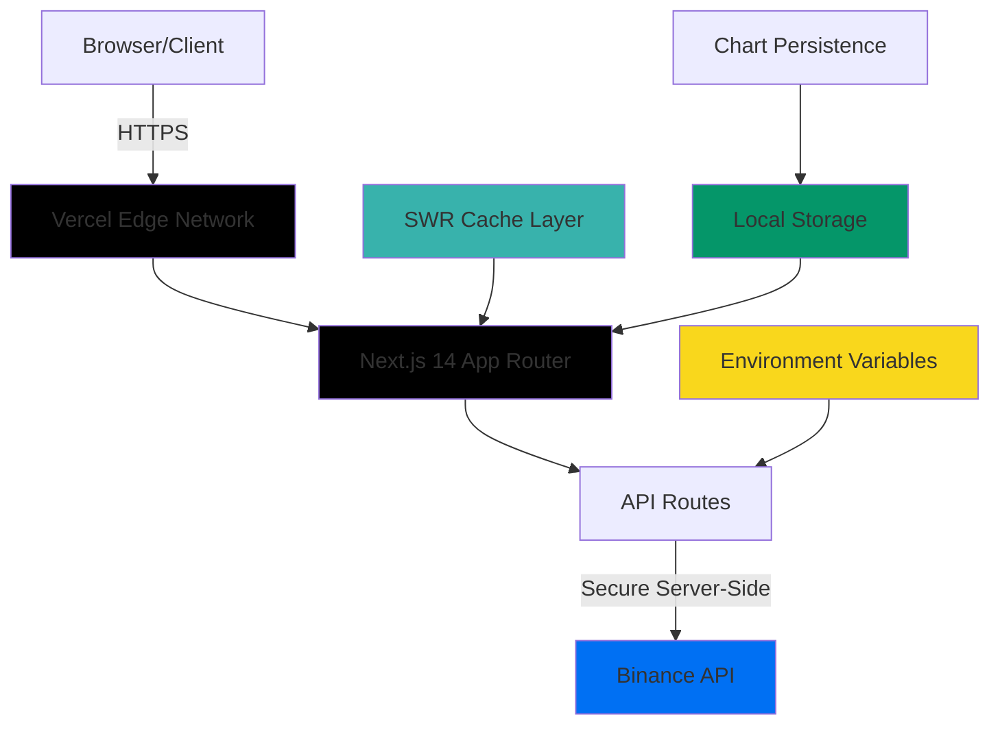

# Crypto Portfolio Analytics - Enterprise Edition

[](https://binance-crypto-dashboard-flax.vercel.app)
[](https://nextjs.org/)
[](https://www.typescriptlang.org/)
[](https://tailwindcss.com/)

Platformă enterprise-level pentru monitorizare și analiză portofoliu crypto, construită cu Next.js 14 și optimizată pentru performanță maximă. Oferă vizualizare în timp real, analytics avansate și design profesional.

## Live Demo: [https://binance-crypto-dashboard-flax.vercel.app](https://binance-crypto-dashboard-flax.vercel.app)

## Caracteristici Enterprise

### Analytics & Monitoring
- Real-time Data - Actualizare la 5 secunde cu SWR caching
- Advanced Chart - Grafic canvas-based cu persistență localStorage
- Multi-Account Support - Spot, Futures, Margin tracking simultan
- P&L Monitoring - Profit/Loss tracking pentru poziții futures
- Open Orders - Management ordere Spot și Futures
- Asset Allocation - Vizualizare distribuție portofoliu

### UI/UX Professional
- Glass Morphism - Design modern cu backdrop blur și gradient
- Enterprise Theme - Color palette profesională și ierarhie vizuală
- Responsive Design - Optimizat perfect pentru mobil și desktop
- Dark/Light Mode - Suport complet pentru theme switching
- Micro-interactions - Hover effects, transiții smooth, loading states

### Security & Performance
- HMAC-SHA256 - Signed requests pentru API Binance
- Smart Caching - 15 secunde cache cu retry logic
- Error Handling - Graceful fallbacks și sanitarizare erori
- Data Persistence - Chart data salvat în localStorage
- Optimized Loading - Dynamic imports și skeleton states

## Arhitectură Enterprise


```mermaid
graph TB
    A[Browser/Client] -->|HTTPS| B[Vercel Edge Network]
    B --> C[Next.js 14 App Router]
    C --> D[API Routes]
    D -->|Secure Server-Side| E[Binance API]
    
    F[Environment Variables] --> D
    G[SWR Cache Layer] --> C
    H[Local Storage] --> C
    I[Chart Persistence] --> H
    
    style E fill:#0070f3
    style C fill:#000
    style B fill:#000
    style F fill:#f9d71c
    style G fill:#38B2AC
    style H fill:#059669
```

### Stack Tehnologic
- Frontend: Next.js 14, React 18, TypeScript 5.4
- Styling: Tailwind CSS 3.4, Glass Morphism effects
- State Management: SWR pentru caching și real-time updates
- Charts: Custom Canvas API cu localStorage persistence
- API Integration: Direct Binance API cu signed requests
- Deployment: Vercel Edge Network cu serverless functions
- Development: ESLint, TypeScript strict, hot reload

## Setup Rapid

### Prerequisites
- Node.js 18+ și npm/yarn
- Cont Binance cu API keys
- Git pentru clonarea repository

### 1. Clone Repository
```bash
git clone https://github.com/Gzeu/binance-crypto-dashboard.git
cd binance-crypto-dashboard
```

### 2. Install Dependencies
```bash
npm ci
# sau
yarn install
```

### 3. Configure Environment
```bash
cp .env.example .env.local
```

Editează `.env.local` cu credențialele Binance:

```env
# Binance API Configuration
# Obține de la: https://www.binance.com/en/my/settings/api-management
BINANCE_API_KEY=your_actual_binance_api_key_here
BINANCE_API_SECRET=your_actual_binance_secret_key_here

# Application Configuration  
NEXT_PUBLIC_APP_URL=http://localhost:3000
```

### 4. Start Development
```bash
npm run dev
# sau
yarn dev
```

Aplicația va fi disponibilă la `http://localhost:3000`

## Configurare API Binance

### Pasul 1: API Key Setup
1. Navighează la [Binance API Management](https://www.binance.com/en/my/settings/api-management)
2. Creează API key cu numele "Portfolio Analytics"
3. Security Settings Recomandate:
   - Enable Reading: Activat
   - Spot & Margin Trading: Activat (opțional)
   - Futures Trading: Activat (opțional)
   - Restrict Access: Doar IP-uri de încredere

### Pasul 2: Testare Conexiune
```bash
curl -H "X-MBX-APIKEY: your_key" \
     "https://fapi.binance.com/fapi/v2/account?timestamp=$(date +%s)000&signature=$(echo -n "timestamp=$(date +%s)000" | openssl dgst -sha256 -hmac -binary your_secret)"
```

### Response Schema Enterprise
```typescript
interface PortfolioData {
  accounts: AccountBalance[];
  totalPortfolioUSDT: string;
  totalSpotUSDT: string;
  totalFuturesUSDT: string;
  totalMarginUSDT: string;
  openPositions: OpenPosition[];
  openOrders: OpenOrder[];
  totalUnrealizedPnL: string;
  canTrade: boolean;
  canWithdraw: boolean;
  canDeposit: boolean;
  updateTime: string;
  serverTime: string;
}

interface AccountBalance {
  accountType: 'spot' | 'futures' | 'margin';
  totalBalanceUSDT: string;
  availableBalanceUSDT: string;
  balances: AssetBalance[];
  marginLevel?: string;
  marginFree?: string;
  marginUsed?: string;
  maintenanceMargin?: string;
}

interface OpenPosition {
  symbol: string;
  positionAmt: string;
  entryPrice: string;
  markPrice: string;
  unRealizedProfit: string;
  liquidationPrice: string;
  leverage: string;
  positionSide: string;
  updateTime: number;
}
```

## Deploy Production

### Metoda 1: Vercel CLI (Recomandată)
```bash
# Instalează Vercel CLI
npm i -g vercel

# Login și Deploy
vercel login
vercel --prod
```

### Metoda 2: GitHub Integration
1. Conectează repository la Vercel
2. Setează environment variables:
   - BINANCE_API_KEY
   - BINANCE_API_SECRET  
   - NEXT_PUBLIC_APP_URL
3. Auto-deploy la fiecare push pe main

## API Documentation

### GET /api/binance-balance

Returnează date complete ale portofoliului cu conversie în USDT pentru toate conturile.

#### Features
- Multi-Account - Spot, Futures, Margin
- Real-time Prices - Prețuri actualizate live
- P&L Calculation - Profit/Loss automat
- Position Tracking - Poziții futures deschise
- Order Management - Ordere active tracking
- Smart Caching - 15 secunde pentru performance
- Error Handling - Retry logic cu exponential backoff

#### Rate Limits
- Binance API: 1200 requests/minut
- Cache intern: 15 secunde
- Retry logic: 3 încercări cu exponential backoff

## Componente Enterprise

### AdvancedChart
- Canvas-based real-time chart cu animations
- Persistență date în localStorage (24h retention)
- Interactive controls (grid, legend, chart type)
- Tooltip-uri hover cu detalii complete
- Data points management cu cleanup automat

### AccountCards
- Multi-account balance display
- Status indicators cu animate pulses
- Individual account metrics
- Margin levels pentru futures
- Responsive grid layout

### OpenPositions
- Futures positions tracking
- P&L calculations și color coding
- Leverage și liquidation price
- Sortable columns cu filtering
- Real-time updates

### OpenOrders
- Spot și futures orders management
- Status tracking și fill percentages
- Symbol grouping pentru vizualizare
- Order type indicators
- Interactive filtering

### AssetTable
- Complete asset holdings table
- Sortare după valoare/asset
- Real-time price updates
- 24h change tracking
- CSV export functionality

## Security Enterprise

### API Security
- Server-side Keys - NICIODATĂ expunere în browser
- HMAC-SHA256 - Signed requests pentru toate API calls
- Environment Validation - Schema Zod strictă
- Rate Limiting - Respectă limitele Binance
- Error Sanitization - Fără leak de informații sensibile

### Data Protection
- Input Validation - Toate datele validate
- CORS Configuration - Doar origini permise
- HTTPS Only - Producție doar over HTTPS
- Environment Isolation - Separare dev/prod configs

## Development Tools

### Scripts Disponibile
```bash
npm run dev         # Development cu hot reload
npm run build       # Build optimizat pentru producție
npm run start       # Production server
npm run lint        # ESLint checking
npm run type-check  # TypeScript validation
```

### Structura Proiectului
```bash
binance-crypto-dashboard/
├── app/
│   ├── api/
│   │   └── binance-balance/route.ts    # Enterprise API route
│   ├── globals.css                     # Global styles + CSS variables
│   ├── layout.tsx                      # Root layout cu providers
│   └── page.tsx                        # Main dashboard
├── components/
│   ├── ui/                              # Reusable UI components
│   │   └── badge.tsx                  # Badge component
│   ├── advanced-chart.tsx              # Canvas-based chart
│   ├── account-cards.tsx               # Multi-account cards
│   ├── open-positions.tsx              # Futures positions
│   ├── open-orders.tsx                 # Orders management
│   └── asset-table.tsx                 # Asset holdings table
├── lib/
│   ├── types.ts                       # Complete TypeScript interfaces
│   ├── chart-persistence.ts           # Chart data localStorage
│   ├── chart-types.ts                # Chart type definitions
│   └── utils.ts                       # Utility functions
├── public/                            # Static assets
├── .env.example                       # Environment template
├── next.config.js                     # Next.js configuration
├── tailwind.config.js                 # Tailwind CSS config
└── tsconfig.json                      # TypeScript config
```

## Troubleshooting Enterprise

### Common Issues & Solutions

#### API Connection Issues
```bash
# Verifică API keys
curl -H "X-MBX-APIKEY: your_key" \
     "https://fapi.binance.com/fapi/v2/account?timestamp=$(date +%s)000&signature=$(echo -n "timestamp=$(date +%s)000" | openssl dgst -sha256 -hmac -binary your_secret)"
```

#### Build Issues
```bash
# Clean rebuild
rm -rf .next node_modules package-lock.json
npm ci
npm run build
```

#### Performance Issues
- Verifică network latency către Binance
- Monitorizează API rate limits
- Optimize localStorage usage
- Verifică memory leaks în browser

### Debug Mode
```bash
# Activează detailed logging
NEXT_PUBLIC_DEBUG=true
```

## Referințe Tehnice

- Binance API Documentation
- Next.js 14 Documentation
- Tailwind CSS Documentation
- Canvas API Documentation
- Vercel Deployment Guide

## Contributing

Contribuțiile sunt binevenite! Pentru feature-uri majore:

1. Fork repository-ul
2. Branch pentru feature (`git checkout -b feature/amazing-feature`)
3. Commit changes (`git commit -m 'Add enterprise feature'`)
4. Push la branch (`git push origin feature/amazing-feature`)
5. Pull Request cu descriere detaliată

### Standards
- TypeScript strict mode
- ESLint configuration respectată
- Component documentation cu JSDoc
- Test coverage pentru funcționalități noi
- Responsive design verificat

## Licență

Acest proiect este licențiat sub MIT License - vezi fișierul LICENSE pentru detalii complete.

## Autor

George Pricop - [Gzeu](https://github.com/Gzeu)

- Email: contact@georgepricop.com
- Website: [georgepricop.com](https://georgepricop.com)
- LinkedIn: [George Pricop](https://linkedin.com/in/georgepricop)
- Twitter: [@georgepricop](https://twitter.com/georgepricop)

## Support acest Proiect

Dacă acest ți-a fost util pentru analiza portofoliului crypto, consideră să:

- Star repository-ul
- Report issues și bugs
- Sugere features și improvements
- Share cu comunitatea crypto

*Construit cu și în București, România*
